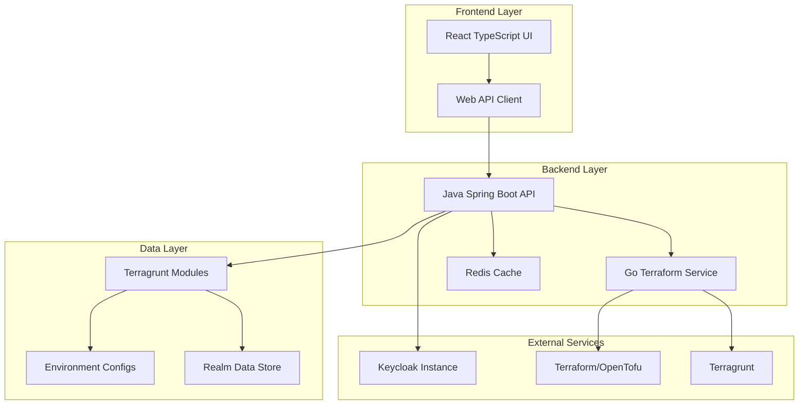
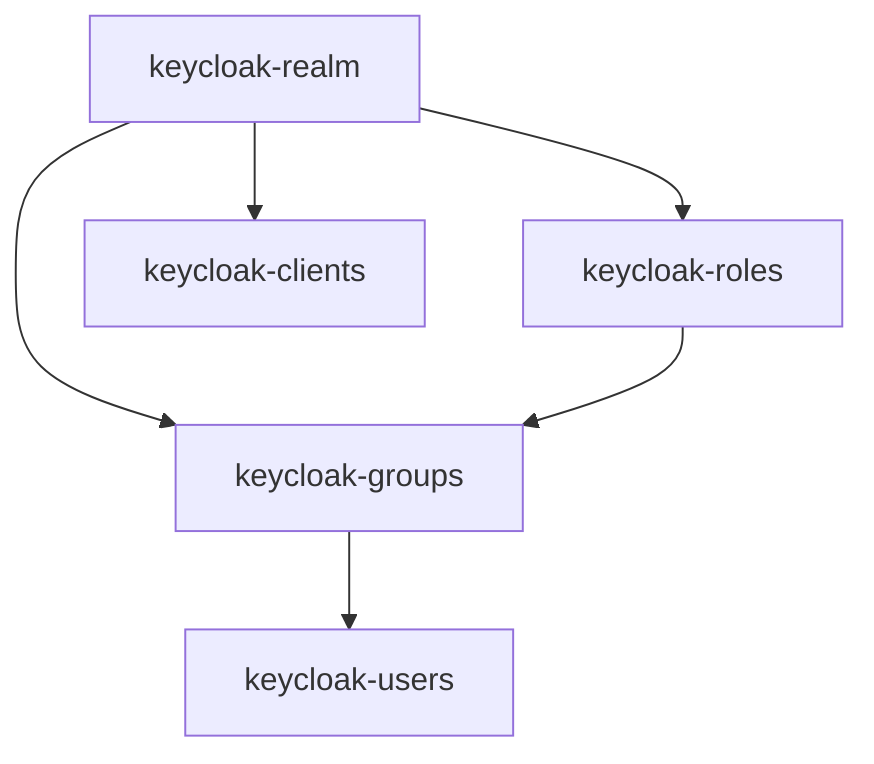
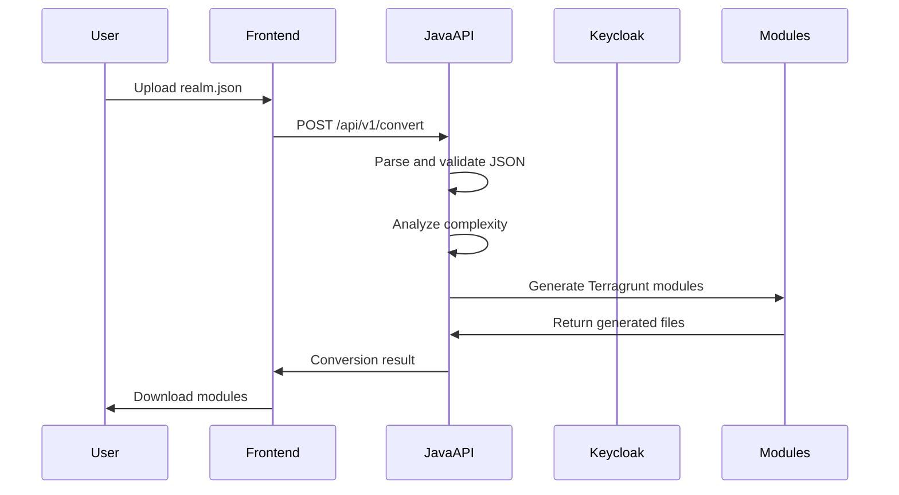
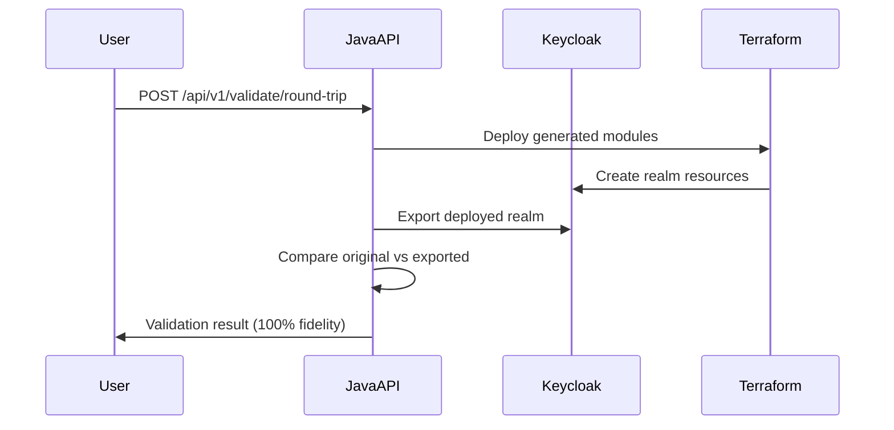

# 🏗️ Architecture Overview

This document provides a comprehensive overview of the Keycloak Terragrunt Forge architecture, design principles, and technical implementation.

## 🎯 Design Principles

### **DRY (Don't Repeat Yourself)**
- Single source of truth for Terragrunt modules
- Reusable modules across multiple realms and environments
- No code duplication between configurations

### **SOLID Principles**
- **S**ingle Responsibility: Each module has one clear purpose
- **O**pen/Closed: Modules are open for extension, closed for modification
- **L**iskov Substitution: Modules can be substituted without breaking functionality
- **I**nterface Segregation: Clean, focused interfaces between components
- **D**ependency Inversion: High-level modules don't depend on low-level modules

### **Enterprise-Grade Standards**
- 100% fidelity validation through round-trip testing
- Comprehensive error handling and logging
- Security-first approach with proper authentication
- Scalable architecture supporting thousands of realms

## 🏛️ System Architecture



## 🏗️ Component Architecture

### **1. Frontend Layer (React TypeScript)**

**Location**: `frontend/src/`

**Responsibilities**:
- User interface for realm upload and conversion
- Real-time preview of generated Terragrunt modules
- File download and export management
- Error handling and user feedback

**Key Components**:
```typescript
frontend/src/
├── components/
│   ├── JsonFileUploader.tsx      # File upload with validation
│   ├── ConversionResults.tsx     # Results display and download
│   └── ui/                       # Reusable UI components
├── utils/
│   └── keycloakToTerragrunt.ts   # Client-side conversion logic
├── pages/
│   ├── Index.tsx                 # Main application page
│   └── NotFound.tsx              # Error page
└── hooks/
    └── use-toast.ts              # Notification system
```

**Technology Stack**:
- **React 18**: Modern hooks-based architecture
- **TypeScript**: Type safety and developer experience
- **Vite**: Fast build tool and development server
- **Tailwind CSS**: Utility-first styling
- **shadcn/ui**: High-quality component library

### **2. Backend Layer**

#### **Java Spring Boot API** (`backend-java/`)

**Responsibilities**:
- Keycloak integration using native Java libraries
- Realm analysis and complexity scoring
- Round-trip validation and fidelity checking
- Business logic and data processing

**Architecture**:
```java
com.keycloak.forge/
├── controller/
│   ├── ConversionController.java    # REST endpoints for conversion
│   └── ValidationController.java    # Round-trip validation APIs
├── service/
│   ├── KeycloakService.java        # Keycloak integration
│   ├── ValidationService.java      # Validation logic
│   └── TerraformGeneratorService.java # Terraform generation
├── model/
│   ├── ConversionRequest.java      # Request DTOs
│   ├── ConversionResult.java       # Response DTOs
│   └── ValidationResult.java       # Validation results
├── config/
│   ├── KeycloakConfig.java         # Keycloak client configuration
│   └── CacheConfig.java            # Caching configuration
└── utils/
    └── TerraformUtils.java         # Terraform utility functions
```

**Key Features**:
- **Native Keycloak Integration**: Uses official Keycloak admin client
- **Caching**: Redis-based caching for performance
- **Security**: JWT authentication and authorization
- **Monitoring**: Actuator endpoints for health checks
- **Testing**: Comprehensive test suite with Testcontainers

#### **Go Terraform Service** (`backend-go/` - Planned)

**Responsibilities**:
- Terraform/OpenTofu operations using native Go libraries
- HCL generation and validation
- Terraform state management
- Performance-critical operations

**Planned Architecture**:
```go
backend-go/
├── cmd/
│   ├── terragrunt-cli/main.go      # CLI tool
│   └── validation-server/main.go   # Validation service
├── internal/
│   ├── terragrunt/
│   │   ├── generator.go            # Terragrunt HCL generation
│   │   └── validator.go            # Terragrunt validation
│   ├── terraform/
│   │   ├── executor.go             # Terraform execution
│   │   └── state.go                # State management
│   └── config/
│       └── loader.go               # Configuration management
└── pkg/
    ├── api/                        # Shared API types
    └── utils/                      # Utility functions
```

### **3. Infrastructure Layer**

#### **Terragrunt Modules** (`modules/`)

**DRY Module Architecture**:
```hcl
modules/
├── keycloak-realm/              # Base realm module
│   ├── main.tf                  # Realm resource definition
│   ├── variables.tf             # Input variables
│   ├── outputs.tf               # Output values
│   └── terragrunt.hcl           # Terragrunt configuration
├── keycloak-groups/             # Groups management module
├── keycloak-users/              # User management module  
├── keycloak-roles/              # Role management module
└── keycloak-clients/            # Client management module
```

**Module Dependencies**:


#### **Environment Configuration** (`environments/`)

**Multi-Environment Support**:
```
environments/
├── dev/
│   └── keycloak/realms/
│       ├── realm-1/terragrunt.hcl
│       └── realm-2/terragrunt.hcl
├── staging/
│   └── keycloak/realms/
└── prod/
    └── keycloak/realms/
```

**Configuration Inheritance**:
```hcl
# Common configuration shared across all environments
include "root" {
  path = find_in_parent_folders("common.hcl")
}

# Environment-specific overrides
inputs = {
  realm_name = "my-realm"
  environment = "dev"
  # Inherits all common settings from root
}
```

## 🔄 Data Flow

### **1. Conversion Flow**



### **2. Validation Flow**



## 🔧 Technical Implementation

### **Dependency Injection**

**Spring Boot Configuration**:
```java
@Configuration
public class AppConfig {
    
    @Bean
    public Keycloak keycloakAdminClient() {
        return KeycloakBuilder.builder()
            .serverUrl(keycloakUrl)
            .realm("master")
            .clientId("admin-cli")
            .username(adminUsername)
            .password(adminPassword)
            .build();
    }
    
    @Bean
    @ConditionalOnProperty("app.cache.enabled")
    public CacheManager cacheManager() {
        return new RedisCacheManager.Builder(jedisConnectionFactory())
            .cacheDefaults(cacheConfiguration())
            .build();
    }
}
```

### **Error Handling**

**Global Exception Handler**:
```java
@ControllerAdvice
public class GlobalExceptionHandler {
    
    @ExceptionHandler(RealmNotFoundException.class)
    public ResponseEntity<ErrorResponse> handleRealmNotFound(
            RealmNotFoundException ex) {
        return ResponseEntity.status(HttpStatus.NOT_FOUND)
            .body(ErrorResponse.builder()
                .error("REALM_NOT_FOUND")
                .message(ex.getMessage())
                .timestamp(Instant.now())
                .build());
    }
}
```

### **Validation Pipeline**

**Round-Trip Validation**:
```java
@Service
public class ValidationService {
    
    public RoundTripValidation performRoundTripValidation(
            RealmRepresentation originalRealm,
            String deployedRealmName) {
        
        // Step 1: Export deployed realm
        RealmRepresentation exportedRealm = 
            exportDeployedRealm(deployedRealmName);
        
        // Step 2: Deep comparison
        ValidationResult comparison = 
            compareRealms(originalRealm, exportedRealm);
        
        // Step 3: Generate report
        return RoundTripValidation.builder()
            .success(comparison.isValid())
            .accuracyPercentage(comparison.getAccuracyPercentage())
            .build();
    }
}
```

## 📊 Performance Considerations

### **Caching Strategy**
- **Application Cache**: Frequently accessed realm configurations
- **Result Cache**: Generated Terragrunt modules for identical inputs
- **Validation Cache**: Round-trip validation results

### **Async Processing**
- **Large Realm Processing**: Background processing for complex realms
- **Batch Operations**: Parallel processing of multiple realms
- **Real-time Updates**: WebSocket updates for long-running operations

### **Resource Management**
- **Connection Pooling**: Keycloak admin client connection management
- **Memory Management**: Streaming large realm.json files
- **File System**: Temporary file cleanup and management

## 🔒 Security Architecture

### **Authentication & Authorization**
- **JWT Tokens**: Secure API access
- **Role-Based Access**: Different permissions for different user types
- **API Rate Limiting**: Protection against abuse

### **Data Protection**
- **Input Validation**: Comprehensive validation of realm.json files
- **Output Sanitization**: Safe generation of Terraform code
- **Audit Logging**: Complete audit trail of all operations

### **Keycloak Integration Security**
- **Secure Credentials**: Environment-based credential management
- **TLS Encryption**: Secure communication with Keycloak instances
- **Least Privilege**: Minimal required permissions for operations

## 🧪 Testing Architecture

### **Test Pyramid**

```
                    /\
                   /  \
                  /E2E \     <- Full pipeline tests
                 /______\
                /        \
               /Integration\ <- API and service tests
              /__________\
             /            \
            /     Unit      \ <- Component and utility tests
           /________________\
```

**Test Categories**:
- **Unit Tests**: Individual component testing (80% coverage)
- **Integration Tests**: Service integration testing (15% coverage)
- **E2E Tests**: Full pipeline validation (5% coverage)

### **Test Infrastructure**
- **Testcontainers**: Real Keycloak instances for testing
- **Mocking**: Service layer mocking for unit tests
- **Test Data**: Comprehensive test realm configurations

## 🚀 Deployment Architecture

### **Development Environment**
```yaml
# docker-compose.dev.yml
services:
  frontend:
    build: ./frontend
    ports: ["3000:80"]
  backend:
    build: ./backend-java
    ports: ["8080:8080"]
  keycloak:
    image: quay.io/keycloak/keycloak:latest
    ports: ["8090:8080"]
```

### **Production Environment**
- **Container Orchestration**: Kubernetes or Docker Swarm
- **Load Balancing**: NGINX or cloud load balancers
- **Service Mesh**: Istio for inter-service communication
- **Monitoring**: Prometheus + Grafana + Jaeger

## 📈 Scalability Considerations

### **Horizontal Scaling**
- **Stateless Services**: All services designed to be stateless
- **Database Scaling**: Read replicas for high-read scenarios
- **Caching Layer**: Redis cluster for high availability

### **Performance Optimization**
- **Lazy Loading**: On-demand module generation
- **Compression**: Gzip compression for large realm files
- **CDN**: Static asset delivery via CDN

## 🔮 Future Architecture Evolution

### **Planned Enhancements**
- **GraphQL API**: More flexible API interface
- **Real-time Collaboration**: Multi-user editing capabilities
- **AI-Powered Analysis**: Intelligent realm optimization suggestions
- **Multi-Cloud Support**: Support for multiple cloud providers

This architecture provides a solid foundation for enterprise-scale Keycloak to Terragrunt conversion while maintaining flexibility for future enhancements.